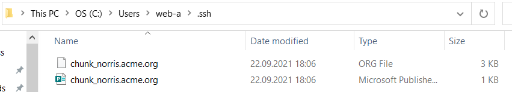

SSH в Windows 10
================

###### 2021-09-22

Оказывается, что Windows 10 содержит `OpenSSH` клиент с апреля 2018 года, который работает вполне по линуксовому, читая
конфигурацию из `%userprofile%\.ssh\config`, и позволяя подключиться к серверу прямо из командной строки `cmd.exe`.
Здесь `%userprofile%` это такой аналог `~` — домашней директории пользователя.

Проверка доступности OpenSSH
----------------------------

1. «Параметры / Приложения / Дополнительные возможности» («Settings / Apps / Optional features»).
2. Ввести "OpenSSH" в поисковой строке.
3. Должен появиться установленный "OpenSSH Client".


Если его нет, нажать там же «Добавить компонент»(«Add a feature»), выбрать "OpenSSH Client" из списка и нажать
«Установить»(«Install»).

Генерация SSH-ключа
-------------------

1. Запустить приложение «Командная строка»(«Command prompt» или `cmd`).
2. Прежде всего следует убедиться, что в домашней директории пользователя существует папка `.ssh`, которая
   используется `OpenSSH Client` для хранения ключей и конфигурации.
   ```
   dir %userprofile%\.ssh
   ```

   

   Если написано `File Not Found`, то следует создать такую директорию.
   ```
   mkdir %userprofile%\.ssh
   ```
   Теперь повторение команды `dir` будет показывать содержимое папки `.ssh` вместо ошибки.

   

3. Запустить команду генерации ssh-ключа
   ```
   ssh-keygen -C %COMMENT% -t "rsa" -f %userprofile%\.ssh\%FILENAME%
   ```
   , где вместо `%COMMENT%` написать в двойных кавычках чей это доступ(логин пользователя и email), а
   вместо `%FILENAME%` следует написать такое имя файла без пробелов, по которому можно узнать пользователя и для какого
   сервера предназначен ключ. Пример далее указывает на пользователя `Chunck Norris` с email `chunk-norris@example.com`,
   который хочет получить доступ к серверу `acme.org`.

   

       Описанная тактика именования ключей и указания комментариев к ним непосредственно не требуется для работы
       `OpenSSH Client`, но позволяет контролировать любое количество SSH-ключей, чётко понимая, для чего используется
       каждый конкретный файл. Именование ключа `id_rsa` считается плохим тоном, и быстро приведёт к путанице, когда
       нужно будет генерировать доступы к другим серверам. В целях повышения безопасности рекомендуется заводить новую
       пару SSH-ключей на каждый сервер или группу серверов. Это позволит в случае компрометации(утечки) приватного
       ключа или иных проблем легче произвести замену на новый, и не подвергать опасности сразу все серверы, где был
       использован скомпрометированный ключ.

   В ходе генерации пары ключей будет запрошен ввод "ключевой фразы"("passphrase"), т.е. пароля, которым будет
   зашифрован приватный ключ. Для доступа к серверам по SSH со своего личного компьютера рекомендуется оставить это поле
   пустым, т.к. приватная часть ключа всё равно будет храниться на локальном компьютере, а пароль придётся вводить при
   каждом входе.

4. Проверка результата командой
   ```
   dir %userprofile%\.ssh
   ```
   показывает, что были созданы два файла с **приватным ключом**(без `.pub`) и с **публичным ключом**(с `.pub` в конце
   имени файла).

   

   

5. Файл публичного ключа следует передать администратору или загрузить в настройки того сервера, куда необходимо
   наладить SSH-доступ. **ВНИМАНИЕ!!!** Приватный ключ **всегда и при любых условиях** должен держаться в тайне и не
   покидать компьютер, на котором был сгенерирован. Утрата приватного ключа должна всегда приводить к необходимости
   незамедлительного удаления публичного ключа со всех серверов, куда с его помощью можно зайти.

   Чтобы не перепутать публичный и приватный ключи может потребоваться включить отображение расширений файлов в
   "Проводнике" Windows: «Вид / Расширения имён файлов»(«View / File name extensions»)

   

   

Конфигурация OpenSSH
--------------------

1. Создать и открыть на редактирование файл `%userprofile%\.ssh\config`, который будет содержать настройки подключения и
   позволит подключаться по SSH, не указывая каждый раз множество дополнительных опций.
   ```
   echo "" > %userprofile%\.ssh\config
   notepad %userprofile%\.ssh\config
   ```

2. Настроить сервер для подключения по шаблону(после последней опции следует добавить пустую строку):
   ```
   Host %HOST_ALIAS%
       HostName %URL_OR_IP%
       User %REMOTE_USER%
       PubkeyAuthentication yes
       IdentityFile %PRIVATE_SSH_KEY_FILE%
   
   ```
   , где
    - `%HOST_ALIAS%` — произвольное название сервера, которое будет использоваться в командной строке для быстрого
      подключения;
    - `%URL_OR_IP%` — имя или IP-адрес сервера;
    - `%REMOTE_USER%` — имя пользователя на сервере;
    - `%PRIVATE_SSH_KEY_FILE%` — полный путь к файлу с приватным ключом.

   

4. Сохранить файл и закрыть текстовый редактор.

Установление соединения
-----------------------

Теперь в командной строке достаточно набрать

```
ssh %HOST_ALIAS%
```

, и будет осуществлено соединение. Здесь `%HOST_ALIAS%` — это строка из конфигурационного файла, которая идёт
после `Host`.


При первом входе подлинность сервера, к которому осуществляется подключение, не может быть проверена по имеющемуся
каналу связи. В теории, следует уточнить у администратора, что показанный "отпечаток пальца"(fingerprint) ключа сервера
корректный, и подключение не осуществляется к чужому серверу. Но этот этап часто пропускают, если речь не идёт о
высоко-конфиденциальных данных. Чтобы продолжить, следует напечатать полностью ответ `yes` и нажать `Enter`. При
следующих подключениях соединение будет устанавливаться сразу, т.к. отпечаток ключа сервера будет храниться в списке
доверенных серверов `%userprofile%\.ssh\known_hosts`.

В случае успешного подключения на экране появится `motd` приветственное сообщение сервера и командная строка будет
содержать имя пользователя и сервера, на который осуществлён вход(при этом имя сервера может отличаться от заданного в
конфигурации).


Отключение осуществляется любым из способов:

- командой `exit`
- командой `logout`
- нажатием клавиш `Ctrl + d`
