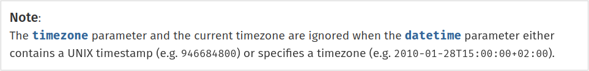

Игнорирование TimeZone в DateTime и DateTimeImmutable
=====================================================

###### 2022-01-12``

У методов

```php
\DateTimeImmutable::createFromFormat(string $format, string $datetime, ?DateTimeZone $timezone = null): DateTimeImmutable|false
```

и

```php
\DateTime::createFromFormat(string $format, string $datetime, ?DateTimeZone $timezone = null): DateTime|false
```

есть хоть и [задокументированная](https://www.php.net/manual/en/datetime.createfromformat.php), но неочевидная
особенность. Даже две:

- если передаётся Unix timestamp, то часовой пояс всегда будет установлен в `UTC` вне зависимости от значения
  аргумента `$timezone`;
- если передаётся формат, в котором уже указан часовой пояс(например, ISO-8601 или Atom), то аргумент `$timezone` будет
  проигнорирован, а часовой пояс установлен по аргументу `$datetime`.

В оригинале:



### Пример кода

```php
$dateOne = new DateTimeImmutable(
    'now',
    new DateTimeZone('+03:00')
);
echo sprintf(
    'date one is %s' . PHP_EOL,
    $dateOne->format(DATE_ISO8601)
);
// Ожидается, что результат будет с часовым поясом '+03:00', но он будет сброшен в UTC.
$dateTwo = DateTimeImmutable::createFromFormat(
    'U',
    $dateOne->getTimestamp(),
    $dateOne->getTimezone()
);
echo sprintf(
    'date two is %s' . PHP_EOL,
    $dateTwo->format(DATE_ISO8601)
);
// Ожидается, что результат будет с часовым поясом '+05:00', но он будет установлен в '+03:00'.
$dateThree = DateTimeImmutable::createFromFormat(
    DATE_ISO8601,
    $dateOne->format(DATE_ISO8601),
    new DateTimeZone('+05:00')
);
echo sprintf(
    'date three is %s' . PHP_EOL,
    $dateThree->format(DATE_ISO8601)
);
```

### Результат

```
date one is 2022-01-12T15:37:42+0300
date two is 2022-01-12T12:37:42+0000
date three is 2022-01-12T15:37:42+0300
```

Будьте внимательны, и не попадайтесь в эту ловушку!
